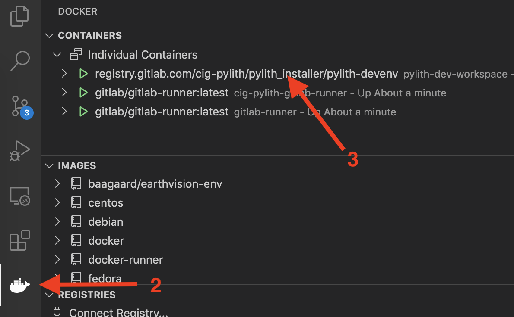

# PyLith development environment Docker image

The `pylith-devenv` Docker image provides all of the dependencies and defines the environment for PyLith development.
It is built using the Ubuntu 20.04 Linux distribution.
It is intended to be read only with a separate Docker volume for persistent storage of the PyLith development workspace.
We separate the development "environment" from the "workspace" so that we can update the development environment without affecting the workspace and easily maintain a persistent workspace while starting and stopping the Docker container that holds the development environment.

In addition to the PyLith dependencies, the Docker image includes the following development tools:

* gdb (debugger)
* valgrind (memory debugging tool)
* lcov (code coverage)
* uncrustify (C++ code formatter)
* autopep8 (Python code formatter)
* matplotlib (Python plotting) [TODO]
* Sphinx with MyST (documentation tools) [TODO]

The Docker image also defines the environment:

| Environment variable |                 Value                 | Decription                                              |
| :------------------- | :-----------------------------------: | :------------------------------------------------------ |
| `PYTHON_VERSION`     |                 `3.8`                 | Python version                                          |
| `PYLITH_USER`        |             `pylith-dev`              | Username within container                               |
| `BASE_DIR`           |             `/opt/pylith`             | Top-level directory for development workspace           |
| `HOME`               |        `/home/${PYLITH_USER}`         | Home directory for user                                 |
| `INSTALL_DIR`        |       `${BASE_DIR}/dest/debug`        | Directory where code is installed                       |
| `TOPSRC_DIR`         |           `${BASE_DIR}/src`           | Top-level directory for source code                     |
| `TOPBUILD_DIR`       |       `${BASE_DIR}/build/debug`       | Top-level directory for building                        |
| `PETSC_DIR`          |         `${TOPSRC_DIR}/petsc`         | Directory for PETSc                                     |
| `PETSC_ARCH`         |          `arch-pylith-debug`          | Build label for PETSc debugging configuration           |
| `PYLITH_BUILDDIR`    |       `${TOPBUILD_DIR}/pylith`        | Top-level directory where we build PyLith [^vscode]     |
| `CIGDEPS_DIR`        |           `${INSTALL_DIR}`            | Directory containing CIG-related dependencies [^vscode] |
| `PYTHON_INCDIR`      |       `/usr/include/python3.8`        | Directory containing Python header files [^vscode]      |
| `MPI_INCDIR`         | `/usr/include/x86_64-linux-gnu/mpich` | Directory containing MPI header files [^vscode]         |
| `PROJ_INCDIR`        |            `/usr/include`             | Directory containing Proj header files [^vscode]        |
| `CPPUNIT_INCDIR`     |            `/usr/include`             | Directory containing CppUnit header files [^vscode]     |

[^vscode]: Environment variables used in Visual Studio Code workspace settings.

## Setup

You only need to run these setup steps once.

:::{admonition} Requirements
:class: important

1. You need to have [Docker](https://www.docker.com/products/docker-desktop) installed and running on your computer.
2. You need to have a [GitHub](https://github.com) account.
:::

### Fork repositories on GitHub

1. Log in to your [GitHub](https://github.com) account.

2. Fork the following repositories:

* <https://github.com/geodynamics/pythia>
* <https://github.com/geodynamics/spatialdata>
* <https://github.com/geodynamics/pylith>

This creates copies of the repositories in your GitHub account.

### Create Docker volume for persistent storage

On your local machine, create a Docker volume for persistent storage.

```bash
docker volume create pylith-dev
```

### Start PyLith development Docker container

Running the command below will:

1. Start (run) the Docker container using the `pylith-devenv` Docker image and assign it the name `pylith-dev-workspace`.
2. Mount the docker volume with persistent storage at `/opt/pylith`. 
3. The `pylith-devenv` Docker image will be downloaded from the GitLab registry <registry.gitlab.com/cig-pylith/pylith_installer>.

```bash
docker run --name pylith-dev-workspace --rm -it -v pylith-dev:/opt/pylith \
    registry.gitlab.com/cig-pylith/pylith_installer/pylith-devenv
```

:::{warning}
Closing the `pylith-dev-workspace` Docker container interactive shell (terminal) will stop the container. Simply run the command again to restart the container.
:::

### Setup directory structure

We will use the following directory structure for the persistent storage.

```bash
/opt/pylith
    ├── src
    │    ├── pythia
    │    ├── spatialdata
    │    ├── petsc
    │    └── pylith
    ├── build
    │   ├── debug
    │   │   ├── pythia
    │   │   ├── spatialdata
    │   │   └── pylith
    │   └── opt
    │       ├── pythia
    │       ├── spatialdata
    │       └── pylith
    └── dest
        ├── debug
        │   ├── bin
        │   ├── include
        │   ├── lib
        │   └── share
        └── opt
            ├── bin
            ├── include
            ├── lib
            └── share
```

All of the source code will be placed under `/opt/pylith/src`. You only need to create the top-level source directory as the subdirectories will be created when you clone (download) the repositories.

This directory structure is set up for both a debugging version for development (debug directory) and an optimized version for performance testing (opt directory).
For now, we will only setup the debugging version.

```bash
cd /opt/pylith
mkdir src
mkdir -p ${TOPBUILD_DIR} && pushd ${TOPBUILD_DIR} && mkdir pythia spatialdata pylith && popd
mkdir -p ${INSTALL_DIR}
```

### Clone repositories

This creates a local copy of the repositories in the persistent storage volume of the PyLith development container.
These are your working copies of the repositories.

```bash
cd /opt/pylith/src
git clone --recursive https://github.com/GITHUB_USERNAME/pythia.git
git clone --recursive https://github.com/GITHUB_USERNAME/spatialdata.git
git clone --recursive https://github.com/GITHUB_USERNAME/pylith.git
git clone --branch knepley/pylith https://gitlab.com/petsc/petsc.git
```

### Configure and build PyLith for development

We build 3 CIG-related dependencies and PyLith:

1. Pythia
2. Spatialdata
3. PETSc
4. PyLith

Pythia, Spatialdata, and PETSc are not include in the Docker image, because they may need to be updated as part of PyLith development.

:::{tip}
To speed up the build process, we set the number of make threads to the number of cores `-j$(nproc)`.
You can often find speedup with up to twice as many threads as the number of cores.
:::

#### Pythia

```bash
cd ${TOPBUILD_DIR}/pythia
pushd ${TOPSRC_DIR}/pythia && autoreconf -if && popd
${TOPSRC_DIR}/pythia/configure --prefix=${INSTALL_DIR} --enable-testing \
    CC=mpicc CXX=mpicxx CFLAGS="-g -Wall" CXXFLAGS="-std=c++11 -g -Wall"
make install
make check
```

#### Spatialdata

```bash
cd ${TOPBUILD_DIR}/spatialdata
pushd ${TOPSRC_DIR}/spatialdata && autoreconf -if && popd
${TOPSRC_DIR}/spatialdata/configure --prefix=${INSTALL_DIR} \
    --enable-swig --enable-testing --enable-test-coverage \
    --with-python-coverage=python3-coverage \
	CPPFLAGS="-I${DEPS_DIR}/include -I${INSTALL_DIR}/include" \
	LDFLAGS="-L${DEPS_DIR}/lib -L${INSTALL_DIR}/lib --coverage" \
	CXX=mpicxx CXXFLAGS="-std=c++11 -g -Wall --coverage"
make install -j$(nproc)
make check -j$(nproc)
```

#### PETSc

```bash
cd ${TOPSRC_DIR}/petsc
python3 ./configure --with-c2html=0 --with-lgrind=0 --with-fc=0 \
    --with-x=0 --with-clanguage=C --with-mpicompilers=1 \
    --with-shared-libraries=1 --with-64-bit-points=1 --with-large-file-io=1 \
    --with-hdf5=1 --download-chaco=1 --download-ml=1 \
    --download-f2cblaslapack=1 --with-debugging=1 CFLAGS="-g -O -Wall" \
    CPPFLAGS="-I${HDF5_INCDIR} -I${DEPS_DIR}/include -I${INSTALL_DIR}/include" \
    LDFLAGS="-L${HDF5_LIBDIR} -L${DEPS_DIR}/lib -L${INSTALL_DIR}/lib"
make 
make check
```

#### PyLith

```bash
cd ${TOPBUILD_DIR}/pylith
pushd ${TOPSRC_DIR}/pylith && autoreconf -if && popd
${TOPSRC_DIR}/pylith/configure --prefix=${INSTALL_DIR} \
    --enable-cubit --enable-hdf5 --enable-swig --enable-testing \
    --enable-test-coverage --with-python-coverage=python3-coverage \
    CPPFLAGS="-I${HDF5_INCDIR} -I${DEPS_DIR}/include -I${INSTALL_DIR}/include" \
    LDFLAGS="-L${HDF5_LIBDIR} -L${DEPS_DIR}/lib -L${INSTALL_DIR}/lib --coverage" \
    CC=mpicc CFLAGS="-g -Wall" CXX=mpicxx CXXFLAGS="-std=c++11 -g -Wall --coverage"
make install -j$(nproc)
make check -j$(nproc)
```

### Install Visual Studio Code

1. Install [Visual Studio Code](https://code.visualstudio.com/) for your computer.
2. Install the following extensions:
    * Remote - Containers
    * C/C++ 
    * Docker
    * Live Share
    * Python
    * Uncrustify
    * Live Share

We recommend also installing the following extensions:

* GitHub Pull Requests and Issues
* GitLens -- Git supercharged
* Material Icon Theme
* autoconf
* Code Spell Checker
* Markdown all in One
* markdownlint
* MyST-Markdown
* Remote-SSH


## Running

### Start PyLith development Docker container

Whenever you need to restart the `pylith-dev-workspace` Docker container, simply run

```bash
docker run --name pylith-dev-workspace --rm -it -v pylith-dev:/opt/pylith \
    registry.gitlab.com/cig-pylith/pylith_installer/pylith-devenv
```

:::{tip}
Make sure Docker is running before you start the container.
:::

### Attach VS Code to Docker container

1. Start VS Code.
2. Click on the Docker extension in the Activity Bar on the far left hand side as illustrated in the [screenshot](docker-attach-vscode).
3. Find the `pylith-dev-workspace` container. Verify that it is running.
4. Right-click on the container and select `Attach Visual Studio Code`. This will open a new window. You should see `Container registry.gitlab.com/cig-pylith...` at the left side of the status bar at the bottom of the window.

:::{figure-md} docker-attach-vscode
:class: myclass



Screenshot showing how to attach VS Code to a running Docker container. 
:::
